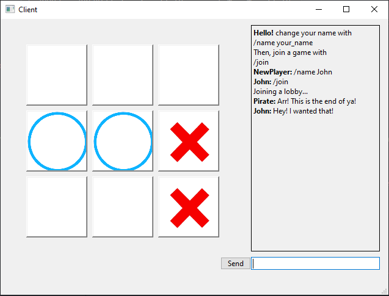

# FastAPI-Azure-TTT
 Online Tic-Tac-toe.
 
  

## Deployment
1.  Navigate your terminal to project's directory,
2.  deploy FastAPI with `uvicorn server:app`,
3.  open 2 clients (use `python client.py`) on your network,
4.  follow instructions in the chat box.
